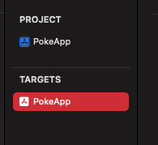

# Ravn-Challenge-V3-AdlerMartinez

## Description
This small app presents a list of pokémon segmented by their respective generations, sorted by number. Each pokémon has its own details which can be accesible by tapping over the pokémon of your choice, the details include the normal sprite, the shiny sprite and the pokémon's evolutions.

## OverView
The general structure of the classes for the Project goes on like this:
PokemonSearchVC: responsible for bringing together all UI elements and observing data changes from the view model in order to render the UI accordingly.
PokemonDetailsVC: VC next to PokemonSearchVC in the navigation stack, limits itself to display the data passed on to it.
PokemonViewModel: responsible for checking internet connection, make service calls, transform data, pass and fetch data from the repository.
PokeAPIService: hosts the methods that will fetch the data from PokeAPI.
PokemonCell, PokemonEvolutionCell, GenHeaderView, LoadingDataCell: they limit themselves to show the expected data.
StoredPokemonRepository: responsible for being the bridge between the view model and Core Data. 
NetworkManager: Holds the Reachability logic so it can be used by the view model.

## Setup/Instructions
- After clonning the project just enter the folder 
- Locate the PokeApp.xcodeproj 
- There's no need to install the libraries, they were cloned along
- Run the project

### If you happen to run into this problem

Go to the project

Select targets

Delete SwiftyGif-Dynamic

Run again

Note: this a problem of the SwiftyGif Library, and sadly there's no good equivalent for it

## Libraries used
- Apollo: to establish connection with the GraphQL service
- SwiftyGif: to display the gifs of the pokemon sprites
- Reachability: to check internet connection
- Toast: to present toasts
